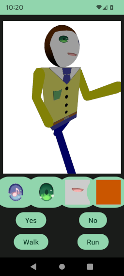
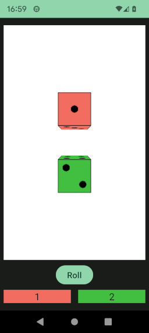
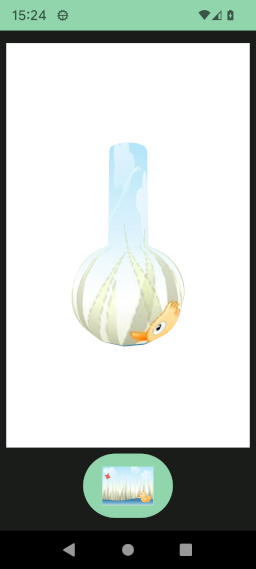
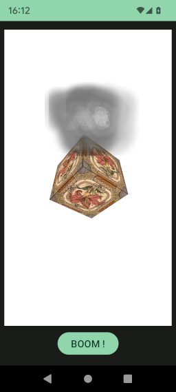

# Engine 3D 

This presents a 3D engine in 100% **Kotlin** that aim to consume few battery and compatible to the most 
of **Android** devices.

It can be used for games or for presentation.
3D scene(s) can be integrates inside any interface like other components view.

It include a particle effect capacity.

Their a standard view and a composable version.

The engine have a standard way to organize the scene and a **DSL** one.

In includes a show case application to show some engine capacities and have usage examples.

We includes also some tools that can be useful.

Some examples of the engine in action :

See more in the documentation, the application code and your exploration.

* [3D engine for Android](engine/doc/Engine.md) : The 3D engine
  * [3D version of hello world](engine/doc/helloWorld/HelloWorld3D.md) : 3D hello world
    * [Classic way](engine/doc/helloWorld/HelloWorld3D.md#classic-way) : XML layout
      * [Standard way](engine/doc/helloWorld/HelloWorld3D.md#standard-way) : Strand way to manipulate objects
      * [DSL way](engine/doc/helloWorld/HelloWorld3D.md#dsl-way) : DSL version
    * [Composable way](engine/doc/helloWorld/HelloWorld3D.md#composable-way) : Use composable component
  * [Material and texture](engine/doc/material/Material.md) : Apply image and tint on object
    * [Material](engine/doc/material/Material.md#material) : Material description and creation
    * [Texture](engine/doc/material/Material.md#texture) : Create a texture
    * [Image source](engine/doc/material/Material.md#image-source) : Image source description
  * [Position in 3D](engine/doc/position/PositionIn3D.md) : Locate objects in coordinate space
    * [Location with coordinates](engine/doc/position/PositionIn3D.md#location-with-coordinates) : Location in
      the screen
    * [Rotations around main axis](engine/doc/position/PositionIn3D.md#rotations-around-main-axis) : To rotate
      object
    * [Scale along main axis](engine/doc/position/PositionIn3D.md#scale-along-main-axis) : To change object
      sizes
    * [Move an object](engine/doc/position/PositionIn3D.md#move-an-object) : Move an object in coordinate space
      * [Absolute change](engine/doc/position/PositionIn3D.md#absolute-change) : Change/set object position
      * [Relative change](engine/doc/position/PositionIn3D.md#relative-change) : Change object position
        relative to it's current position
        * [Translation](engine/doc/position/PositionIn3D.md#translation) : Translate an object
        * [Rotation](engine/doc/position/PositionIn3D.md#rotation) : Rotate an object
        * [Scale](engine/doc/position/PositionIn3D.md#scale) : Scale an object
  * [Node hierarchy](engine/doc/nodeHierarchy/NodeHierarchy.md) : Hierarchy in 3D
  * [Nodes and objects](engine/doc/nodesAndObjects/NodesAndObjects.md) : Nodes and objects provied by the engine
    * [Node 3D](engine/doc/nodesAndObjects/geometry/Node3D.md) : More about 3D node
    * [Object 3D](engine/doc/nodesAndObjects/geometry/Object3D.md) : Generic object 3D
    * [Clone 3D](engine/doc/nodesAndObjects/geometry/Clone3D.md) : Copy any object 3D to save memory
    * [Plane](engine/doc/nodesAndObjects/geometry/Plane.md) : Pre-build object : A simple plane
    * [Box](engine/doc/nodesAndObjects/geometry/Box.md) : Pre-build object : A box wih capacity to define how
      texture is applies on each face
    * [Sphere](engine/doc/nodesAndObjects/geometry/Sphere.md) : Pre-build object : A sphere with can choose the
      precision
    * [Revolution](engine/doc/nodesAndObjects/geometry/Revolution.md) : Pre-build object : A revolution, that
      is to say a path rotated around Y axis.
    * [Field 3D](engine/doc/nodesAndObjects/geometry/Field3D.md) : Pre-build object : Simple filed defines by
      an equation
    * [Dice](engine/doc/nodesAndObjects/geometry/Dice.md) : Complex object that represents a dice
    * [Robot](engine/doc/nodesAndObjects/geometry/Robot.md) : Complex set of objects attached in a node, it
      represents an humanoid robot here can move each body part.
  * [Scene3D](engine/doc/scene/Scene3D.md) : The scene draw
  * [View 3D](engine/doc/view/View3D.md) : Customize View 3D
    * [Customize the default manipulation](engine/doc/view/View3D.md#customize-the-default-manipulation) :
      Customize the default manipulation
    * [Change the default manipulation](engine/doc/view/View3D.md#change-the-default-manipulation) : Change the
      default manipulation.
      * [Customize manipulation](engine/doc/view/View3D.md#customize-manipulation)  : Completely customize
        the touch reaction
      * [Block all interaction](engine/doc/view/View3D.md#block-all-interaction) : No more interaction
      * [Touch to move](engine/doc/view/View3D.md#touch-to-move) : Move manipulate object instead of rotate
        it
      * [Sensitive touch](engine/doc/view/View3D.md#sensitive-touch) : Sensitive touch the screen
        * [Customizable sensitive](engine/doc/view/View3D.md#customizable-sensitive) : Customize the
          sensitive reaction
        * [Virtual joystick](engine/doc/view/View3D.md#virtual-joystick) : Virtual joystick over the screen
  * [Animation](engine/doc/animation/Animation.md) : Animate nodes and objects
  * [3D sound](engine/doc/sound/Sound3D.md) : 3D sound effect.
  * [Particle effect](engine/doc/particleEffect/ParticleEffect.md) : Particle effect
* [Animations](animations/doc/Animations.md) : Generic animations
  * [Generic animation description](animations/doc/Animations.md#generic-animation-description) : How to implements animation
  * [Animation loop](animations/doc/Animations.md#animation-loop) : Loop on animation until a method is called
  * [Animation based a function](animations/doc/Animations.md#animation-based-a-function) : Use a function to describe the animation
  * [Animation list](animations/doc/Animations.md#animation-list) : List of animations played one after other
  * [Pause animation](animations/doc/Animations.md#pause-animation) : Make a pause in animation
  * [Animations played in parallel](animations/doc/Animations.md#animations-played-in-parallel) : Animations launched and played in same time
  * [Animation that launch a task](animations/doc/Animations.md#animation-that-launch-a-task) : Launch a task in animation
  * [Animation key frame](animations/doc/Animations.md#animation-key-frame) : Animations bases on key frame
    * [Generic animation based on frame description](animations/doc/Animations.md#generic-animation-based-on-frame-description) : Describes how implements a generic key frame animation
    * [Animate a 3D node](animations/doc/Animations.md#animate-a-3d-node) : Animate a node/object in 3D
    * [Robot animation](animations/doc/Animations.md#robot-animation) : Animates a robot
* [Playing sounds](sound/doc/SoundDocumentation.md) : Play sound
* [Images documentation](images/doc/ImagesDocumentation.md) : Images manipulation tools
  * [Path](images/doc/images/path/Path.md) : Create a path
    * [Quadratic](images/doc/images/path/Path.md#quadratic) : Quadratic curve details
    * [Cubic](images/doc/images/path/Path.md#cubic) : Cubic curve details
    * [Elliptic arc](images/doc/images/path/Path.md#elliptic-arc) : Elliptical arc curve details
  * [Images manipulations](images/doc/images/ImagesManipulations.md) : Some images manipulation tools
    * [Canvas extensions](images/doc/images/ImagesManipulations.md#canvas-extensions) : Extensions for draw on canvas
    * [Bimap extensions](images/doc/images/ImagesManipulations.md#bimap-extensions) : Extensions for manipulate images pixels
    * [Flying functions](images/doc/images/ImagesManipulations.md#flying-functions) : Additional functions for manipulate images
* [Collection](collection/doc/Collection.md) : Additional collection utilities
* [Tasks](tasks/doc/TasksDocumentation.md) : Tools for manage threading
  * [ThreadSafeQueue](tasks/doc/tasks/ThreadSafeQueue.md) Queue where access in thread safe
  * [TaskType](tasks/doc/tasks/TaskType.md) Type of task in parallel
  * [Mutex](tasks/doc/tasks/Mutex.md) Mutual exclusion
  * [Promises and futures](tasks/doc/tasks/future/FutureResult.md) Do task in separate thread and react to completion
    * [Promise](tasks/doc/tasks/future/FutureResult.md#promise) : Make a promise of a future result
    * [FutureResult](tasks/doc/tasks/future/FutureResult.md#futureresult) : Follow a promised result
    * [Future continuation](tasks/doc/tasks/future/FutureResult.md#future-continuation) : Link a continuation to the result
    * [React to error or cancel individually](tasks/doc/tasks/future/FutureResult.md#react-to-error-or-cancel-individually)
    * [Future tools](tasks/doc/tasks/future/FutureResult.md#future-tools) : Some tools for help to specific case
      * [Simplify FutureResult<FutureResult<R>>](tasks/doc/tasks/future/FutureResult.md#simplify-futureresultfutureresultr)
      * [Wait that several future complete before react](tasks/doc/tasks/future/FutureResult.md#wait-that-several-future-complete-before-react)
      * [Short cut when response already known](tasks/doc/tasks/future/FutureResult.md#short-cut-when-response-already-known)
  * [Flow extensions](tasks/doc/tasks/extensions/FlowExtensions.md) Some coroutines' flow extensions.
  * [Functions extensions](tasks/doc/tasks/extensions/FunctionsExtensions.md) Some functions extensions.
  * [Network management](tasks/doc/tasks/network/NetworkStatusManager.md) Manage network to make network task type available.
* [Additional math tools](math/doc/MathDocumentation.md) : Mathematical tools
  * [Colors](math/doc/math/Colors.md) : Colors constants
  * [Random](math/doc/math/Random.md) : Choose something randomly.
  * [Angles](math/doc/math/Angle.md) : Angle representation.
  * [Math additional tools](math/doc/math/Math.md) : Math additional tools.
  * [Formal functions](math/doc/math/formal/FormalFunction.md) : Formal functions
    * [Constant](math/doc/math/formal/FormalFunction.md#constant) : Defines constants
    * [Variable](math/doc/math/formal/FormalFunction.md#variable) : Define variables
    * [Cosinus](math/doc/math/formal/FormalFunction.md#cosinus) : Cosinus function
    * [Sinus](math/doc/math/formal/FormalFunction.md#sinus) : Sinus function
    * [Unary minus](math/doc/math/formal/FormalFunction.md#unary-minus) : Opposite of a function
    * [Addition](math/doc/math/formal/FormalFunction.md#addition) : Add two functions
    * [Subtraction](math/doc/math/formal/FormalFunction.md#subtraction) : Subtract two functions
    * [Multiplication](math/doc/math/formal/FormalFunction.md#multiplication) : Multiply two functions
    * [Division](math/doc/math/formal/FormalFunction.md#division) : Divide two functions
    * [Operations can be made on formal functions](math/doc/math/formal/FormalFunction.md#operations-can-be-made-on-formal-functions) : Operations can be do with function
  * [Number ans String extensions](math/doc/math/extensions/NumberAndStringExtensions.md) : Extensions for Number and String
    * [Double extensions](math/doc/math/extensions/NumberAndStringExtensions.md#double-extensions) : Extensions for Double
    * [Float extensions](math/doc/math/extensions/NumberAndStringExtensions.md#float-extensions) : Extensions for Float
    * [Long extensions](math/doc/math/extensions/NumberAndStringExtensions.md#long-extensions) : Extensions for Long
    * [Int extensions](math/doc/math/extensions/NumberAndStringExtensions.md#int-extensions) : Extensions for Int
    * [String extensions](math/doc/math/extensions/NumberAndStringExtensions.md#string-extensions) : Extensions for String
  * [Math 3D](math/doc/math/MathFor3D.md) : Math tools used in 3D engine.
    * [Point2D](math/doc/math/MathFor3D.md#frjhelpandroidlibrarymathpoint2dsrcmainjavafrjhelpandroidlibrarymathpoint2dkt) : 2D point
    * [Point3D](math/doc/math/MathFor3D.md#frjhelpandroidlibrarymathpoint3dsrcmainjavafrjhelpandroidlibrarymathpoint3dkt) : 3D point
    * [Vector3D](math/doc/math/MathFor3D.md#frjhelpandroidlibrarymathvector3dsrcmainjavafrjhelpandroidlibrarymathvector3dkt) : 3D vector
    * [Rotation3D](math/doc/math/MathFor3D.md#frjhelpandroidlibrarymathrotation3dsrcmainjavafrjhelpandroidlibrarymathrotation3dkt) : 3D rotation
    * [Matrix](math/doc/math/MathFor3D.md#frjhelpandroidlibrarymathmatrixsrcmainjavafrjhelpandroidlibrarymathmatrixkt) : 3x3 matrix
* [Provider](provider/doc/Provider.md) : A simple way to provide/inject instances.
