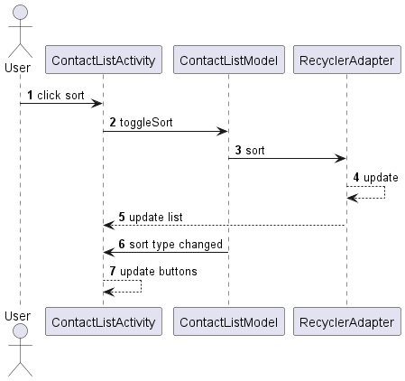
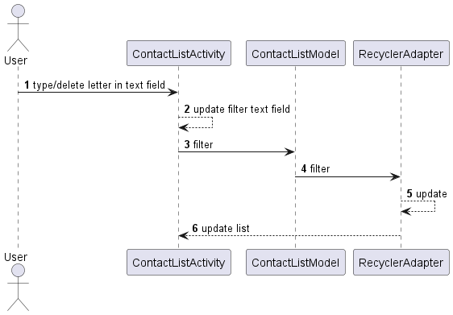

# Compose and architecture

The aim is to explore **Android compose** and propose tools for help to have a good organization.

It is a work in progress and will add and may change things as we learn more about compose and also
future compose API changes/evolution.

The aim here is to separate the role UI should do only UI, no intelligence or logic.

We separate the sample application in two modules :

The UI in `app` module and models in `app_models`. In future we plan to do more thing in sample like
use a data base or and/or store in preferences. We plan to create an other module named `app_data`
to manage the data. If we also add network request an `app_network` will appear

Each `app_...` will shared interfaces for interaction and provide an implementation. The real
implementation will be internal to avoid temptation to direct access.

We try to put in other modules all things that can be reuse in an other application. But with
compose it didn't be possible for all of them (code auto-generation failed). That's why, we put
those exceptions in a separate package in `app` module.

## Application

Actual application application show a text change and a list of fake contacts

A contact have a mandatory first and last name and an optional secret identity.

We want show them in list separate by letters depends if sort by first or last name.

By example if in contact we have :

```text
Barry Allen
Diego Vega
Arthur Dent
Bruce Wayne
```

Sort by first name it will show :

```text
--- A ---
Arthur Dent
--- B ---
Barry Allen
Bruce Wayne
--- C ---
--- D ---
Diego Vega
--- E ---
--- F ---
...
--- Z ---
```

Sort by last name it will show :

```text
--- A ---
Barry Allen
--- B ---
--- C ---
--- D ---
Arthur Dent
--- E ---
--- F ---
...
--- V ---
Diego Vega
--- W ---
Bruce Wayne
--- X ---
--- Y ---
--- Z ---
```

The application is able to switch between the two order

The application provides a filter system.

If something typed in filter, show only contacts with first or last name that start with the search
typed. No more letters shows when filter. The search is case insensitive.

For example if type `a` in filter, with previous example sort by first name, it shows :

```text
Arthur Dent
Barry Allen
```

Since `Arthur` and `Allen` starts with `A`

Special rule for secret identity, have to type the complete secret identity to show the contact.

By example type `Batma` will show nothing, but with complete `Batman` it will show `Bruce Wayne`

Secret identity is secret so not shows.

To illustrate the exchanges here the sort list sequence diagram



And the filter exchange



### Model

Models are in `app_models` module

In `fr.jhelp.composeclean.models` there :

[TextChoice](app_models/src/main/java/fr/jhelp/composeclean/models/TextChoice.kt) : An enumeration
of text type show in alternative text show

[SortType](app_models/src/main/java/fr/jhelp/composeclean/models/SortType.kt) : An enumeration of
sort's type in contact list

[Models](app_models/src/main/java/fr/jhelp/composeclean/models/Models.kt) : To provide activities
models implementation

In `fr.jhelp.composeclean.models.contact` there :

All things link to contact. Since we want show letters and contact, we have :

* A generic [Contact](app_models/src/main/java/fr/jhelp/composeclean/models/contact/Contact.kt)
  interface
* [ContactSeparator](app_models/src/main/java/fr/jhelp/composeclean/models/contact/ContactSeparator.kt) :
  A virtual contact to represents a letter
* [ContactPerson](app_models/src/main/java/fr/jhelp/composeclean/models/contact/ContactPerson.kt) :
  A real contact person
* Two comparators to sort contact
  list : [ContactFirstNameComparator](app_models/src/main/java/fr/jhelp/composeclean/models/contact/ContactFirstNameComparator.kt)
  and [ContactLastNameComparator](app_models/src/main/java/fr/jhelp/composeclean/models/contact/ContactLastNameComparator.kt)

In `fr.jhelp.composeclean.models.shared` there :

The models used by activities. One model per activity.

Due compose restrictions we need an initializer that UI should call first to provide a link for
manipulate interface

As we said before models are interfaces an real implementation is internal.

[MainModel](app_models/src/main/java/fr/jhelp/composeclean/models/shared/MainModel.kt) details :

In main activity we have a text that change and a button to change it

`initialize` method provide the text holder for change

`changeText` change the text

[ContactListModel](app_models/src/main/java/fr/jhelp/composeclean/models/shared/ContactListModel.kt)
details :

In contact list activity we have to fill/sort/filter a list model. An change buttons enable state
depends on sort type. That's why in `initialize` we collect the model to manipulate and holder to
signal sort change to UI

`toggleSort` : Change first name sort by last name sort and vice versa.

`filter` : Apply a filter to the list. Empty filter will remove filters

In `fr.jhelp.composeclean.models.shared.preview` :

Sample models can be used in compose preview :
[MainModelPreview](app_models/src/main/java/fr/jhelp/composeclean/models/shared/preview/MainModelPreview.kt)
and [ContactListModelPreview](app_models/src/main/java/fr/jhelp/composeclean/models/shared/preview/ContactListModelPreview.kt)

In `fr.jhelp.composeclean.models.implementation` :

The real implementation of activities models

[MainModelImplementation](app_models/src/main/java/fr/jhelp/composeclean/models/implementation/MainModelImplementation.kt)
for main activity

[ContactListModelImplementation](app_models/src/main/java/fr/jhelp/composeclean/models/implementation/ContactListModelImplementation.kt)
for contact activity

### UI

Application UI is in `app` module package `fr.jhelp.composeclean`

We have an
application : [ComposeCleanApplication](app/src/main/java/fr/jhelp/composeclean/ComposeCleanApplication.kt)
. In `onCreate` method we provide the application context and inject the activities models

In `fr.jhelp.composeclean.ui.theme` you will find the application's compose theme

Each activity, in `fr.jhelp.composeclean.ui.activities` have its composable description
in `fr.jhelp.composeclean.ui.composables`. We have also to render contact list cell their composable
are in `fr.jhelp.composeclean.ui.composables.contact`

[MainActivity](app/src/main/java/fr/jhelp/composeclean/ui/activities/MainActivity.kt) show the
composable
[MainActivityComposable](app/src/main/java/fr/jhelp/composeclean/ui/composables/MainActivityComposable.kt)

`MainActivityComposable` gets the provided application context and its model. It have the
method `Show` (Start with upper case letter is compose convention) to show the UI and
`Preview`method to show a preview on Android studio

In `Show` method we first create holder for `textChoice` change and provide it to the model. This
creation must be done in Composable method and as soon as possible, so here its the perfect spot.

Then it follows the UI description. Use the holder for the text would let compose the capacity to
update the text each time a new value is given.

In button click we delegate the action to the model. The UI should not have to know of the
consequence of button click, so that's a good practice to delegate action to model.

In `Preview` we inject the preview model first then call `Show`. If the preview model is not
injected, the system will complains that it can't found the model, because application is not
launched in preview, so no models are injected.

[ContactListActivity](app/src/main/java/fr/jhelp/composeclean/ui/activities/ContactListActivity.kt)
show the composable
[ContactListActivityComposable](app/src/main/java/fr/jhelp/composeclean/ui/composables/ContactListActivityComposable.kt)

`ContactListActivityComposable` get its provided model It have the method `Show` to show the UI and
`Preview`method to show a preview on Android studio

in `Show` method we first create the recycler view, to have its model, and holder for `sortType`. We
create a filter holder to manage the text field for filter (TODO : Find a better component than
`BasicTextField` or create one to not have do the trick each time)
We provide the recycler view model and `sortType`holder to the model

Thew we create the UI. the `fillMaxSize` is not necessary in theory, but it permits to view the list
in preview.

The `BasicTextField` is tricky, we had to have a holder to cumulate the letters type, show the text
and manage the hint our self.

In `Preview` we inject the preview model first then call `Show`.

For draw contact in list, we
use [ContactComposable](app/src/main/java/fr/jhelp/composeclean/ui/composables/contact/ContactComposable.kt)
. Depends on the contact type, aa separator or real contact, it
calls [ContactSeparatorComposable](app/src/main/java/fr/jhelp/composeclean/ui/composables/contact/ContactSeparatorComposable.kt)
or [ContactPersonComposable](app/src/main/java/fr/jhelp/composeclean/ui/composables/contact/ContactPersonComposable.kt)

## Tools

Here found a brief description of each tools, for more details about usage see their respective
documentation given in link.

### Provider

Provides instances its an injection like system in light version. Aim to be light, easy to use, not
automatic generate code, no annotation

See for more details : [Provider](provider/doc/Provider.md)

### Constraint

Some tools for simplify margin definition in constraint layout in compose

See for more details : [Constraint](constraint/doc/Constraint.md)

### Common

Common tools shared between model and application

See for more details : [Common](common/doc/Common.md)

### Collection

Additional collections and tools around collections in general

See for more details : [Collection](collection/doc/Collection.md)

### Create mutable

Mutable creation (see `Mutable` in [Common](common/doc/Common.md)). If compose was allowed us, it
would be there, but for now it is here :
[Create mutable](app/doc/CreateMutable.md)

### Recycler composable

Easy list or grid (Depends on number of grid span specified). No need to manage empty placeholder.
Easy to sort and filter data.

It should be in separate module, but compose not let us, that's it is there :
[Recycler compose](app/doc/RecyclerComposable.md) 


