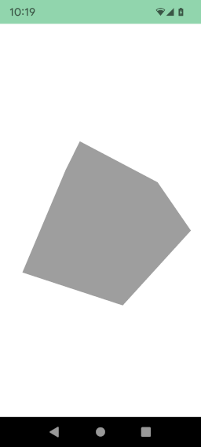

## 3D version of hello world

At the end of this tutorial we will obtain a grey cube like :



Fir we need a component where the 3D scene. The engine propose two versions :

For classic XML version : [fr.jhelp.android.library.engine.view.View3D](../../src/main/java/fr/jhelp/android/library/engine/view/View3D.kt)

For composable version : [fr.jhelp.android.library.showcase.ui.engine.View3DComposable](../../../app/src/main/java/fr/jhelp/android/library/showcase/ui/engine/View3DComposable.kt)

* [Classic way](#classic-way) : XML layout
  * [Standard way](#standard-way) : Strand way to manipulate objects
  * [DSL way](#dsl-way) : DSL version
* [Composable way](#composable-way) : Use composable component

## Classic way

In layout XML (For example) :

```xml
    <fr.jhelp.android.library.engine.view.View3D
        android:id="@+id/view3D"
        android:layout_width="match_parent"
        android:layout_height="match_parent" />
```

You will have an empty scene. To add the cube, get the view 3D in the code.

```kotlin
import fr.jhelp.android.library.engine.view.View3D
// ...
    /**
     * Called when activity is created
     */
    @MainThread
    override fun onCreate(savedInstanceState: Bundle?)
    {
        super.onCreate(savedInstanceState)
        this.setContentView(R.layout.activity_3d_game)
        val view3D: View3D = this.findViewById(R.id.view3D)
        // ...
    }
// ...
```

After that you have two options, use standard way or use **DSL** way

* [Standard way](#standard-way) : Strand way to manipulate objects
* [DSL way](#dsl-way) : DSL version

### Standard way

First to avoid ANR, to it in a different thread than main/UI thread.
To do it yo can use tools in this Github (See [Tasks](../../../tasks/doc/TasksDocumentation.md)) 
or coroutine, or classic thread, or RX Java, .... Choose your preferred method. 

Here an example with tools provides by this Github (See [Tasks](../../../tasks/doc/TasksDocumentation.md)

```kotlin
import fr.jhelp.android.library.engine.view.View3D
import fr.jhelp.android.library.tasks.extensions.parallel
// ...
    /**
     * Called when activity is created
     */
    @MainThread
    override fun onCreate(savedInstanceState: Bundle?)
    {
        super.onCreate(savedInstanceState)
        this.setContentView(R.layout.activity_3d_game)
        val view3D: View3D = this.findViewById(R.id.view3D)
        // ...
        this::create3D.parallel(view3D)
    }

// ...
    private fun create3D(view3D : View3D)
    {
        // ...    
    }
// ...
```

Now we have the view we can add the cube inside the embed scene

```kotlin
import fr.jhelp.android.library.engine.scene.geometry.Box
import fr.jhelp.android.library.engine.view.View3D
import fr.jhelp.android.library.tasks.extensions.parallel
// ...
    /**
     * Called when activity is created
     */
    @MainThread
    override fun onCreate(savedInstanceState: Bundle?)
    {
        super.onCreate(savedInstanceState)
        this.setContentView(R.layout.activity_3d_game)
        val view3D: View3D = this.findViewById(R.id.view3D)
        // ...
        this::create3D.parallel(view3D)
    }

// ...
    private fun create3D(view3D : View3D)
    {
        view.scene3D.root.add(Box())
        // ...    
    }
// ...
```

If you launch the code like this, you will still see a white screen. 
Its because we are inside the cube and the inside is not drawing. 
To see the cube, we have to push the scene forward.

```kotlin
import fr.jhelp.android.library.engine.scene.geometry.Box
import fr.jhelp.android.library.engine.view.View3D
import fr.jhelp.android.library.tasks.extensions.parallel
// ...
    /**
     * Called when activity is created
     */
    @MainThread
    override fun onCreate(savedInstanceState: Bundle?)
    {
        super.onCreate(savedInstanceState)
        this.setContentView(R.layout.activity_3d_game)
        val view3D: View3D = this.findViewById(R.id.view3D)
        // ...
        this::create3D.parallel(view3D)
    }

// ...
    private fun create3D(view3D : View3D)
    {
        val scene3D = view.scene3D
        scene3D.root.position.z = -2f
        scene3D.root.add(Box())
        // ...    
    }
// ...
```

So now we have the grey cube.
By default touch the 3D view make the scene turn, so slide finger on screen to rotate the cube.

### DSL way

Here the thread management is done for you, so you don't have care about it.

Add the cube

```kotlin
import fr.jhelp.android.library.engine.extensions.tree
import fr.jhelp.android.library.engine.view.View3D
// ...
    /**
     * Called when activity is created
     */
    @MainThread
    override fun onCreate(savedInstanceState: Bundle?)
    {
        super.onCreate(savedInstanceState)
        this.setContentView(R.layout.activity_3d_game)
        val view3D: View3D = this.findViewById(R.id.view3D)
        // ...
        view3D.tree {
            this.root { box() }
        }
    }
// ...
```

If you launch the code like this, you will still see a white screen.
Its because we are inside the cube and the inside is not drawing.
To see the cube, we have to push the scene forward.

```kotlin
import fr.jhelp.android.library.engine.extensions.tree
import fr.jhelp.android.library.engine.view.View3D
// ...
    /**
     * Called when activity is created
     */
    @MainThread
    override fun onCreate(savedInstanceState: Bundle?)
    {
        super.onCreate(savedInstanceState)
        this.setContentView(R.layout.activity_3d_game)
        val view3D: View3D = this.findViewById(R.id.view3D)
        // ...
        view3D.tree {
            this.scenePosition { this.z = -2f }
            this.root { this.box() }
        }
    }
// ...
```

So now we have the grey cube.
By default touch the 3D view make the scene turn, so slide finger on screen to rotate the cube.

## Composable way

Only DSL way is available to keep on composable philosophy.

```kotlin
import fr.jhelp.android.library.showcase.ui.engine.View3DComposable
// ...
private val view3DComposable = View3DComposable()
// ...
@Composable
fun ShowGreyCube()
{
    // ...
    view3DComposable.Draw(modifier)
    // ...
}
```

By default the 3D cube is here, but to be explicit, add the cube :

```kotlin
import fr.jhelp.android.library.showcase.ui.engine.View3DComposable
// ...
private val view3DComposable = View3DComposable()
// ...
@Composable
fun ShowGreyCube()
{
    // ...
    view3DComposable.Draw(modifier) {
        this.root { this.box() }
    }
    // ...
}
```

If you launch the code like this, you will still see a white screen.
Its because we are inside the cube and the inside is not drawing.
To see the cube, we have to push the scene forward.

```kotlin
import fr.jhelp.android.library.showcase.ui.engine.View3DComposable
// ...
private val view3DComposable = View3DComposable()
// ...
@Composable
fun ShowGreyCube()
{
    // ...
    view3DComposable.Draw(modifier) {
        this.scenePosition { this.z = -2f }
        this.root { this.box() }
    }
    // ...
}
```

So now we have the grey cube.
By default touch the 3D view make the scene turn, so slide finger on screen to rotate the cube.

