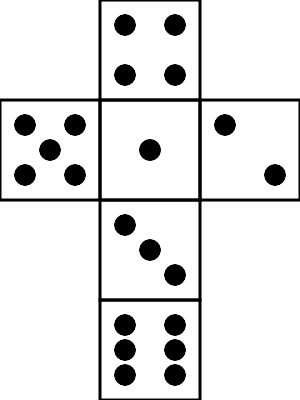

# Box

[fr.jhelp.android.library.engine.scene.geometry.Box](../../../src/main/java/fr/jhelp/android/library/engine/scene/geometry/Box.kt)
is a pre-build [object 3D](Object3D.md) that represents a box.

By default it's material's texture is applied fully on each face.

Standard way

```kotlin
import  fr.jhelp.android.library.engine.scene.geometry.Box

// ...
val box = Box()
// ...
```

DSL way

```kotlin
import fr.jhelp.android.library.engine.extensions.tree
import fr.jhelp.android.library.engine.view.View3D

// ...
   view3D.tree {
        this.root {
            this.box {
                // ...
            }
        }
    }
// ...
```

Its possible to choose of texture is apply on each face, to do it, use 
[fr.jhelp.android.library.engine.scene.geometry.BoxUV](../../../src/main/java/fr/jhelp/android/library/engine/scene/geometry/BoxUV.kt)
and specify it on construction.

`BoxUV` is composed on six 
[fr.jhelp.android.library.engine.scene.geometry.FaceUV](../../../src/main/java/fr/jhelp/android/library/engine/scene/geometry/FaceUV.kt)
one for each box face.

`FaceUV` describes a rectangle inside the texture.

If texture is cross texture in this orientation :



It is more simple to use
[fr.jhelp.android.library.engine.scene.geometry.CrossUV](../../../src/main/java/fr/jhelp/android/library/engine/scene/geometry/CrossUV.kt).
If all face have same proportion, the default version can be used. 
See the class documentation for other cases.


