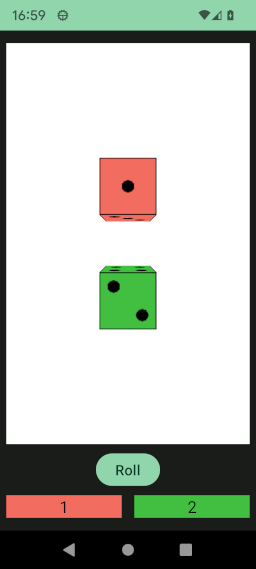

# Dice

[fr.jhelp.android.library.engine.scene.geometry.dice.Dice](../../../src/main/java/fr/jhelp/android/library/engine/scene/geometry/dice/Dice.kt)
represents a dice.

At construction its possible to choose the start value, by default it is randomly choose.

`value` field give the current value

`diceInfoState` permits to register to any dice status change

`value(Int, Int)` method creates an animation to put dice at specified value with the specified
number of frames.
See [Animations](../../animation/Animation.md) for more details about animations and how launch
them.

`roll()` method creates an animation to roll the dice.
To roll again to not obtain same number, create a new animation with this method.
See [Animations](../../animation/Animation.md) for more details about animations and how launch
them.

`color(Color3D)` method changes the dice color.
