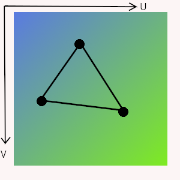
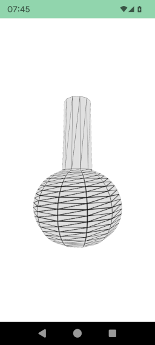

# Object 3D

An [fr.jhelp.android.library.engine.scene.Object3D](../../../src/main/java/fr/jhelp/android/library/engine/scene/Object3D.kt)
is an [fr.jhelp.android.library.engine.scene.Node3D](../../../src/main/java/fr/jhelp/android/library/engine/scene/Node3D.kt)
(See [Node 3D](Node3D.md)) with a mesh and material to be draw in the 3D space.

The material (See [Material](../../material/Material.md)) describes what to draw on the object.

The mesh in a set of triangles with on each triangles' vertex a texture coordinate associate (called UV). 

Since texture are images, they are 2D  so need only 2 coordinates

For texture coordinates it use the letters **U** for ordinate and **V** for abscissa to no confuse them from **X** and **Y** of he vertex position.
(Remember we are in 3D, so there also a **Z**, see [Position in 3D](../../position/PositionIn3D.md))

**U** and **V** are not in pixels but a a percentage of the width and the height in [[0, 1]].



The other points inside the triangle interpolate the texture pixel to use so only need specify texture
coordinates for each vertex.

If `U` or `V` are bigger than one (or negative, its like texture is round, tha is to say `2.3` is same as `0.3`.
This propriety can be used for repeat texture several times, by example specify on a triangle vertex 
`U=0.3 V=0.2` and other `U=2.4 V=0.2` then the texture will be repeat two times on texture width anlog the triangle edge.

To add a triangle to object :

Standard way :

```kotlin
import fr.jhelp.android.library.engine.scene.Object3D

    val object3D = Object3D()

    object3D.addTriangle(0.2f, 5f, 3f,
                         0.1f, 0.2f,
                         8f, 4.1f, -5.2f,
                         0.2f, 0.3f,
                         7f, 8f, 3f,
                         .5f, 0.9f)
```

DSL way

```kotlin
        this.root {
            this.object3D {
                this.addTriangle(0.2f, 5f, 3f,
                                 0.1f, 0.2f,
                                 8f, 4.1f, -5.2f,
                                 0.2f, 0.3f,
                                 7f, 8f, 3f,
                                 .5f, 0.9f)
            }
        }
```

Some times it is more easy to add a quadrilateral, be sure it is convex and all vertex are in same plan, else may experience some bad visual experience.
Use the method `addSquare` to add one.

To save some memory, the object can be seal with the `seal` method. 
Once object is sealed, no more triangles or square can be add (the methods will do nothing).
Once its seal its forever, it can't be reversed.

Object can be `doubleFace` that's mean each triangle can be see in both side. it is useful for not closed object like plane.
If object is closed (like box, sphere, ...) and we will never see the inside it s recommended to not make them double face 
to not compute face side never see.

It is possible to generate a material with a texture that show the wire frame, that is to say the object's triangles.
Note the a square is in reality two triangles. 

Before add the object as a node child or in the scene, call `showWire` method.
If you want apply an other texture, you can keep in memory the the material's texture to be able use it later.


