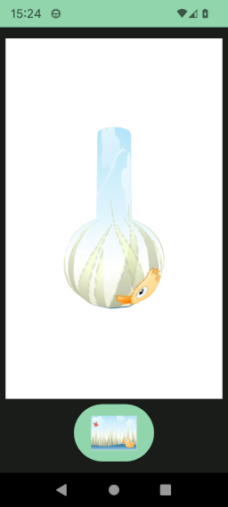

# Revolution

[fr.jhelp.android.library.engine.scene.geometry.Revolution](../../../src/main/java/fr/jhelp/android/library/engine/scene/geometry/Revolution.kt)
is a pre-build [object 3D](Object3D.md) that represents a revolution.

A `Revolution` is a [Path](../../../../images/doc/images/path/Path.md) defined in 2D rotated along Y
axis.

An example can be a bottle :


Imagine cut the bottle along plane with X and Y. take only X positive part.
You will obtain the bottle profile. If you rotate this profile along Y axis you will obtain the
bottle agin.
To describes the bottle profile we use a path.

Note :
> To have a better result it is recommended to start path by the greater Y (For the top to bottom)
> and don't use negative value for X.

Standard way

```kotlin
import fr.jhelp.android.library.engine.scene.geometry.Revolution
import fr.jhelp.android.library.images.path.Path
import fr.jhelp.android.library.math.AngleFloat
import fr.jhelp.android.library.math.AngleUnit

// ...
val path = Path()
path.moveTo(0.2f, 1f)
path.lineTo(0.22f, 0f)
path.ellipticArcTo(radiusX = 0.5f, radiusY = 0.5f,
                   rotationAxisX = AngleFloat(90f, AngleUnit.DEGREE),
                   largeArc = true, sweep = false,
                   endX = 0f, endY = -1f)
val revolution = Revolution(path)
//...
```

// DSL way

```kotlin
import fr.jhelp.android.library.engine.extensions.tree
import fr.jhelp.android.library.engine.view.View3D
import fr.jhelp.android.library.math.AngleFloat
import fr.jhelp.android.library.math.AngleUnit

// ...
view3D.tree {
    this.root {
        this.revolution(path = {
            this.moveTo(0.2f, 1f)
            this.lineTo(0.22f, 0f)
            this.ellipticArcTo(radiusX = 0.5f, radiusY = 0.5f,
                               rotationAxisX = AngleFloat(90f, AngleUnit.DEGREE),
                               largeArc = true, sweep = false,
                               endX = 0f, endY = -1f)
        }) {
            //
        }
    }
}
// ...
```

To change bottle aspect, can change the precision at construction

Standard way

```kotlin
import fr.jhelp.android.library.engine.scene.geometry.Revolution
import fr.jhelp.android.library.images.path.Path
import fr.jhelp.android.library.math.AngleFloat
import fr.jhelp.android.library.math.AngleUnit

// ...
val path = Path()
path.moveTo(0.2f, 1f)
path.lineTo(0.22f, 0f)
path.ellipticArcTo(radiusX = 0.5f, radiusY = 0.5f,
                   rotationAxisX = AngleFloat(90f, AngleUnit.DEGREE),
                   largeArc = true, sweep = false,
                   endX = 0f, endY = -1f)
val revolution = Revolution(path,
                            rotationPrecision = 4)
//...
```

DSL way

```kotlin
import fr.jhelp.android.library.engine.extensions.tree
import fr.jhelp.android.library.engine.view.View3D
import fr.jhelp.android.library.math.AngleFloat
import fr.jhelp.android.library.math.AngleUnit

// ...
view3D.tree {
    this.root {
        this.revolution(
            rotationPrecision = 5,
            path = {
                this.moveTo(0.2f, 1f)
                this.lineTo(0.22f, 0f)
                this.ellipticArcTo(radiusX = 0.5f, radiusY = 0.5f,
                                   rotationAxisX = AngleFloat(90f, AngleUnit.DEGREE),
                                   largeArc = true, sweep = false,
                                   endX = 0f, endY = -1f)
            }) {
            // ..
        }
    }
}
// ...
```
