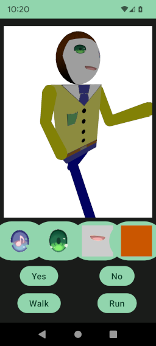

# Robot

[fr.jhelp.android.library.engine.scene.geometry.robot.Robot](../../../src/main/java/fr/jhelp/android/library/engine/scene/geometry/robot/Robot.kt)
represents a robot. That is to say an articulates humanoid.



In `Robot` methods are dedicated to change an articulation angle or change a part of robot look
like.

The [fr.jhelp.android.library.engine.scene.geometry.robot.RobotPosition](../../../src/main/java/fr/jhelp/android/library/engine/scene/geometry/robot/RobotPosition.kt)
represents each articulation angles

The robot have
a [fr.jhelp.android.library.engine.scene.geometry.robot.Head](../../../src/main/java/fr/jhelp/android/library/engine/scene/geometry/robot/Head.kt)
that can be customized on changed eyes, mouth and/or hair.
To see the change result, have to call the method `refresh()`

[fr.jhelp.android.library.engine.scene.geometry.robot.RobotAnimation](../../../src/main/java/fr/jhelp/android/library/engine/scene/geometry/robot/RobotAnimation.kt)
is an animation dedicated to animation a robot.
See [Animations](../../animation/Animation.md)

About animation some pre-build animation exists in extensions methods

[fr.jhelp.android.library.engine.scene.geometry.robot.animation.headYesAnimation](../../../src/main/java/fr/jhelp/android/library/engine/scene/geometry/robot/animation/HeadAnimations.kt)
field extension is an animation to make the robot say yes

[fr.jhelp.android.library.engine.scene.geometry.robot.animation.headNoAnimation](../../../src/main/java/fr/jhelp/android/library/engine/scene/geometry/robot/animation/HeadAnimations.kt)
field extension is an animation to make the robot say no

[fr.jhelp.android.library.engine.scene.geometry.robot.animation.run](../../../src/main/java/fr/jhelp/android/library/engine/scene/geometry/robot/animation/RunAnimation.kt)
method extension to make the robot run

[fr.jhelp.android.library.engine.scene.geometry.robot.animation.stand](../../../src/main/java/fr/jhelp/android/library/engine/scene/geometry/robot/animation/StandAnimation.kt)
method extension to make the robot return to its stand position

[fr.jhelp.android.library.engine.scene.geometry.robot.animation.walk](../../../src/main/java/fr/jhelp/android/library/engine/scene/geometry/robot/animation/WalkAnimation.kt)
method extension to make the robot walk

Standard way

```kotlin
import fr.jhelp.android.library.engine.scene.geometry.robot.Robot

// ...
val robot = Robot()
val nodeToUse = robot.mainNode
// ...
```

DSL way

```kotlin
import fr.jhelp.android.library.engine.extensions.tree
import fr.jhelp.android.library.engine.scene.geometry.robot.Robot
import fr.jhelp.android.library.engine.view.View3D

// ...
val robot = Robot()

view3D.tree {
    this.root {
        this.node { this.add(robot.mainNode) }
    }
}
// ...
```
