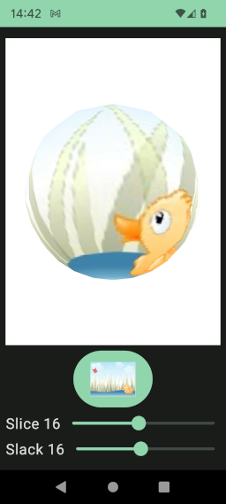

# Sphere

[fr.jhelp.android.library.engine.scene.geometry.Sphere](../../../src/main/java/fr/jhelp/android/library/engine/scene/geometry/Sphere.kt)
is a pre-build [object 3D](Object3D.md) that represents a sphere.

```kotlin
import  fr.jhelp.android.library.engine.scene.geometry.Sphere

// ...
val sphere = Sphere()
// ...
```

DSL way

```kotlin
import fr.jhelp.android.library.engine.extensions.tree
import fr.jhelp.android.library.engine.view.View3D

// ...
   view3D.tree {
        this.root {
            this.sphere {
                // ...
            }
        }
    }
// ...
```

By default texture is applied around the sphere and precision is enough to look round, 
but not too much to have a minimum of triangle.

Sphere construction allow to change that.

`multiplierU` : decides how much texture width is repeat.
* Less than one only a texture width part is used.
* More than 1 width is repeated.

`multiplierV` : decides how much texture height is repeat.
* Less than one only a texture height part is used
* More than 1 height is repeated.

`slice` : Sphere slice number. value in [[2, 32]]. 
Tries different values to understand how ist influence the sphere look like.

`slack` : Sphere slack number. value in [[2, 32]].
Tries different values to understand how ist influence the sphere look like.

For `slice` and `slack`can look the show case :



Code : [fr.jhelp.android.library.showcase.ui.composables.EngineSphereComposable](../../../../app/src/main/java/fr/jhelp/android/library/showcase/ui/composables/EngineSphereComposable.kt)
