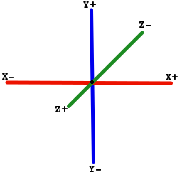
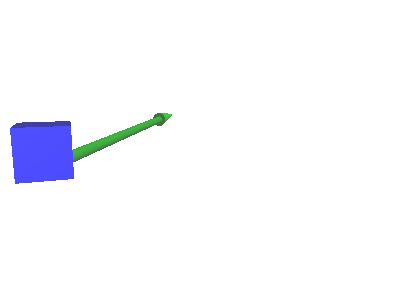
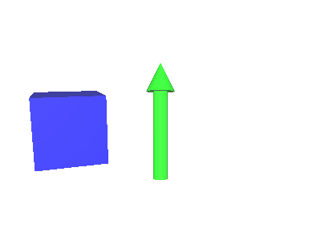

# Position in 3D

In this engine position of an object is compose of 3 parts :

* [Location with coordinates](#location-with-coordinates) : Location in the screen
* [Rotations around main axis](#rotations-around-main-axis) : To rotate object
* [Scale along main axis](#scale-along-main-axis) : To change object sizes
* [Move an object](#move-an-object) : Move an object in coordinate space
  * [Absolute change](#absolute-change) : Change/set object position
  * [Relative change](#relative-change) : Change object position relative to it's current position
    * [Translation](#translation) : Translate an object
    * [Rotation](#rotation) : Rotate an object
    * [Scale](#scale) : Scale an object

## Location with coordinates

The engine work in an 3 dimensions cartesian coordinate system.
That means it is a 3 dimensions orthonormal coordinate system with same distance on each axis.

To be more clear :

* 3 dimensions means that the space in separates in 3 axis:
    * One for horizontal (called ordinate axis or X-axis)
    * One for vertical (called abscissa axis or Y-axis)
    * One for depth (called depth axis or Z-axis)
* Orthonormal means that :
    * Each axis are orthogonal each other. In an other word, their a perpendicular angle between
      axis
    * Each axis have a distance from the intersection

A drawing to illustrate :



## Rotations around main axis

The object can be turn around each axis with a coordinate system relative to it's center point.
The result is that it turns on it self

## Scale along main axis

The object can be scale, that is to say change size, alog each axis

## Move an object

* [Absolute change](#absolute-change) : Change/set object position
* [Relative change](#relative-change) : Change object position relative to it's current position
  * [Translation](#translation) : Translate an object
  * [Rotation](#rotation) : Rotate an object
  * [Scale](#scale) : Scale an object


Move an object means change it's position (location, rotation, scale). It can be absolute a relative
to its current position.

### Absolute change

```kotlin
import fr.jhelp.android.library.engine.extensions.position

// ****************************************
// *** Standard way for change position ***
// ****************************************
// Location
object3D.position.x = 1f
object3D.position.y = 2.3f
object3D.position.z = -2.3f
// Rotation (angles in degree)
object3D.position.angleX = 12.5f
object3D.position.angleY = -25f
object3D.position.angleZ = 6.23f
// Scale
object3D.position.scaleX = 2f
object3D.position.scaleY = 1.2f
object3D.position.scaleZ = 0.2f

// ***********************************
// *** DSL way for change position ***
// ***********************************
object3D.position {
    // Location
    this.x = 1f
    this.y = 2.3f
    this.z = -2.3f
    // Rotation (angles in degree)
    this.angleX = 12.5f
    this.angleY = -25f
    this.angleZ = 6.23f
    // Scale
    this.scaleX = 2f
    this.scaleY = 1.2f
    this.scaleZ = 0.2f
}
```

### Relative change

* [Translation](#translation) : Translate an object
* [Rotation](#rotation) : Rotate an object
* [Scale](#scale) : Scale an object

#### Translation

Translation move object in coordinate space



```kotlin
import fr.jhelp.android.library.engine.extensions.position

// Standard
object3D.position.translate(1.2f, 2.6f, -5f)

// DSL
object3D.position {
    this.translate(1.2f, 2.6f, -5f)
}
```

#### Rotation

Rotate object around an axis



```kotlin
import fr.jhelp.android.library.engine.extensions.position

// Standard
object3D.position.angleZ += 1.23f

// DSL
object3D.position {
    this.angleZ += 1.23f
}
```

#### Scale

Scale object long axis


```kotlin
import fr.jhelp.android.library.engine.extensions.position

// Standard scale all axis with same value
object3D.position.scale(1.23f)
// Standard scale different on axis 
object3D.position.scale(1.23f, 2.5f, .3f)

// DSL
object3D.position {
    // All axis with same value
    this.scale(1.23f)
    // Scale different on axis 
    this.scale(1.23f, 2.5f, .3f)
}
```
