# Images manipulations

We add some extensions for `android.graphics.Canvas` and `android.graphics.Bitmap` to add some image manipulation.

We also have some flying methods

* [Canvas extensions](#canvas-extensions) : Extensions for draw on canvas
* [Bimap extensions](#bimap-extensions) : Extensions for manipulate images pixels
* [Flying functions](#flying-functions) : Additional functions for manipulate images

## Canvas extensions

|                  Extension signature                  | Description                                                    |                    Illustration                    |                                                                                                                                      Usage link                                                                                                                                      |
|:-----------------------------------------------------:|:---------------------------------------------------------------|:--------------------------------------------------:|:------------------------------------------------------------------------------------------------------------------------------------------------------------------------------------------------------------------------------------------------------------------------------------:|
|   neonLine(Float, Float, Float, Float, Int, Paint)    | Draw neon line on a canvas.                                    |     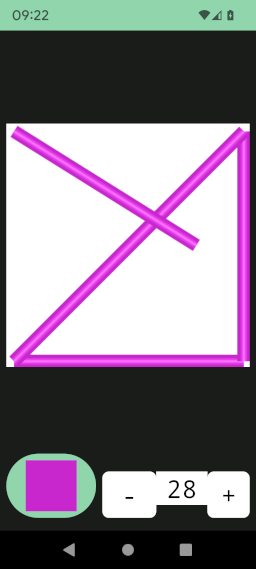      |         [Neon line model](../../../app_models/src/main/java/fr/jhelp/android/library/models/implementation/ImageNeonLinesModelImplementation.kt) [Neon line ui](../../../app/src/main/java/fr/jhelp/android/library/showcase/ui/composables/ImageNeonLinesComposable.kt)         |
|             bitmap(Bitmap, Float, Float)              | Draw a bitmap on place its up left corner at given coordinates |                        N/A                         |                                                                                                                                         N/A                                                                                                                                          |
|             center(Bitmap, Float, Float)              | Draw a bitmap on place its center at given coordinates         |                        N/A                         |                                                                                                                                         N/A                                                                                                                                          |
| repeatOnLine(Bitmap, Float, Float, Float, Float, Int) | Draw a bitmap several times on follow given segment.           | 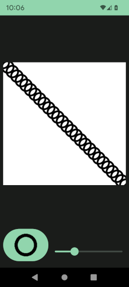 | [Repeat on line model](../../../app_models/src/main/java/fr/jhelp/android/library/models/implementation/ImageRepeatOnLineModelImplementation.kt) [Repeat on line ui](../../../app/src/main/java/fr/jhelp/android/library/showcase/ui/composables/ImageRepeatOnLineComposable.kt) |
|       fitRectangle(Bitmap, Int, Int, Int, Int)        | Draw bitmap to toke all place in given rectangle               |                        N/A                         |                                                                                                                                         N/A                                                                                                                                          |

## Bimap extensions

|         Extension signature         | Description                                           |               Illustration                |                                                                                                                              Usage link                                                                                                                              |
|:-----------------------------------:|:------------------------------------------------------|:-----------------------------------------:|:--------------------------------------------------------------------------------------------------------------------------------------------------------------------------------------------------------------------------------------------------------------------:|
|             clear(Int)              | Clear bitmap with given color                         |                    N/A                    |                                                                                                                                 N/A                                                                                                                                  |
|               grey()                | Transform the bitmap to its gey version               |   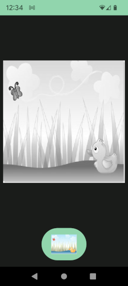    |     [Grey image model](../../../app_models/src/main/java/fr/jhelp/android/library/models/implementation/ImageGreyModelImplementation.kt) [Grey image ui](../../../app/src/main/java/fr/jhelp/android/library/showcase/ui/composables/ImageGreyComposable.kt)     |
|              tint(Int)              | Tint the bitmap with given color                      |   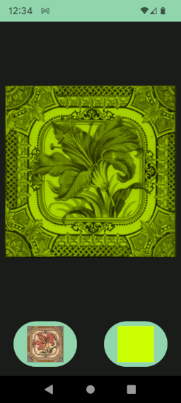    |     [Tint image model](../../../app_models/src/main/java/fr/jhelp/android/library/models/implementation/ImageTintModelImplementation.kt) [Tint image ui](../../../app/src/main/java/fr/jhelp/android/library/showcase/ui/composables/ImageTintComposable.kt)     |
|  mask(Bitmap, Int, Int, Int, Int)   | Apply a mask to a part of the bitmap                  |      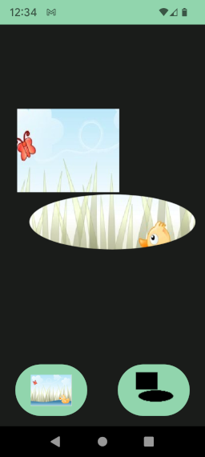       |           [Mask model](../../../app_models/src/main/java/fr/jhelp/android/library/models/implementation/ImageMaskModelImplementation.kt) [Mask ui](../../../app/src/main/java/fr/jhelp/android/library/showcase/ui/composables/ImageMaskComposable.kt)           |
|           shift(Int, Int)           | Shift bitmap pixels                                   |     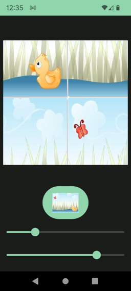      |         [Shift model](../../../app_models/src/main/java/fr/jhelp/android/library/models/implementation/ImageShiftModelImplementation.kt) [Shift ui](../../../app/src/main/java/fr/jhelp/android/library/showcase/ui/composables/ImageShiftComposable.kt)         |
|            copy(Bitmap)             | Copy another bitmap.                                  |                    N/A                    |                                                                                                                                 N/A                                                                                                                                  |
|               copy()                | Create a copy of the bitmap                           |                    N/A                    |                                                                                                                                 N/A                                                                                                                                  |
|          contrast(Double)           | Change image contrast                                 |  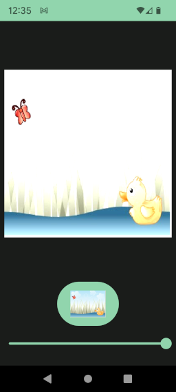   |   [Contrast model](../../../app_models/src/main/java/fr/jhelp/android/library/models/implementation/ImageContrastModelImplementation.kt) [Contrast ui](../../../app/src/main/java/fr/jhelp/android/library/showcase/ui/composables/ImageContrastComposable.kt)   |
|          multiply(Bitmap)           | Multiply this bitmap pixels by given bitmap pixels.   |  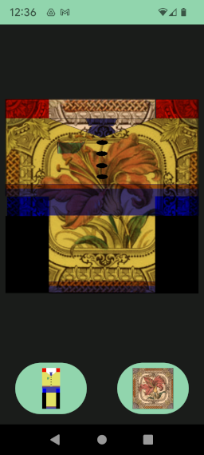   |   [Multiply model](../../../app_models/src/main/java/fr/jhelp/android/library/models/implementation/ImageMultiplyModelImplementation.kt) [Multiply ui](../../../app/src/main/java/fr/jhelp/android/library/showcase/ui/composables/ImageMultiplyComposable.kt)   |
|             add(Bitmap)             | Add this bitmap pixels by given bitmap pixels.        |       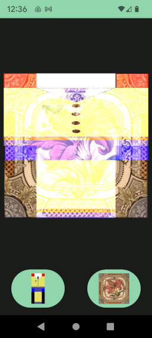        |             [Add model](../../../app_models/src/main/java/fr/jhelp/android/library/models/implementation/ImageAddModelImplementation.kt) [Add ui](../../../app/src/main/java/fr/jhelp/android/library/showcase/ui/composables/ImageAddComposable.kt)             |
|             darker(Int)             | Make the image darker                                 |    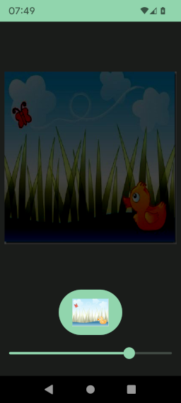     |       [Darker model](../../../app_models/src/main/java/fr/jhelp/android/library/models/implementation/ImageDarkerModelImplementation.kt) [Darker ui](../../../app/src/main/java/fr/jhelp/android/library/showcase/ui/composables/ImageDarkerComposable.kt)       |
|            lighter(Int)             | Make the image lighter                                |                    N/A                    |                                                                                                                                 N/A                                                                                                                                  |
|           invertColors()            | Invert bitmap colors                                  | 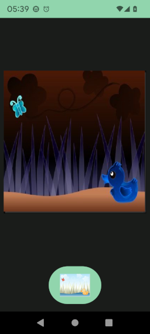 | [Invert model](../../../app_models/src/main/java/fr/jhelp/android/library/models/implementation/ImageInvertColorsModelImplementation.kt) [Invert ui](../../../app/src/main/java/fr/jhelp/android/library/showcase/ui/composables/ImageInvertColorsComposable.kt) |
| pixelsOperation((IntArray) -> Unit) | Do operation on bitmap pixels                         |                    N/A                    |                                                                                                                                 N/A                                                                                                                                  |
|          fitSpace(Bitmap)           | Draw a bitmap scaled to take all place in this bitmap |                    N/A                    |                                                                                                                                 N/A                                                                                                                                  |
|    draw((Canvas, Paint) -> Unit)    | Draw on bitmap                                        |                    N/A                    |                                                                                                                                 N/A                                                                                                                                  |

## Flying functions

|                        Signature                        | Description                                               |            Illustration            |                                                                                                                       Usage link                                                                                                                       |
|:-------------------------------------------------------:|:----------------------------------------------------------|:----------------------------------:|:------------------------------------------------------------------------------------------------------------------------------------------------------------------------------------------------------------------------------------------------------:|
|              createBumped(Bitmap, Bitmap)               | Create a bumped image from base image and image for bump. | 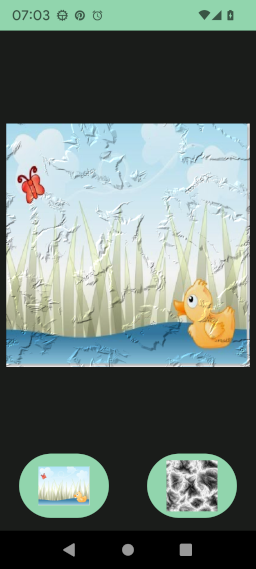 | [Bump model](../../../app_models/src/main/java/fr/jhelp/android/library/models/implementation/ImageBumpMapModelImplementation.kt) [Bump ui](../../../app/src/main/java/fr/jhelp/android/library/showcase/ui/composables/ImageBumpMapComposable.kt) |
| createBitmap(Int, Int, (Bitmap, Canvas, Paint) -> Unit) | Create a bitmap and specify what to draw on it            |                N/A                 |                                                                                                                          N/A                                                                                                                           |
