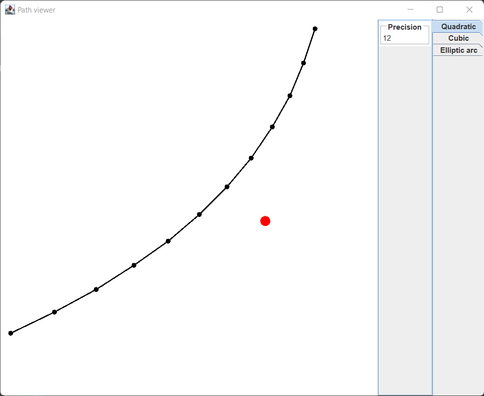

# Path

[fr.jhelp.android.library.images.path.Path](../../../src/main/java/fr/jhelp/android/library/images/path/Path.kt) 
describes a list of elements to follow a path. 

Path can be continue or not, it cans describes a shape.

Imagine have a pen and a paper. To draw have to start down the pen on paper, then draw a segment, 
then from destination point a curve, ...

* [Quadratic](#quadratic) : Quadratic curve details
* [Cubic](#cubic) : Cubic curve details
* [Elliptic arc](#elliptic-arc) : Elliptical arc curve details

Imagine a pen and a paper. First choose where start in paper, then put pen down in this start point. 
After draw a segment, at end of segment add a curve, at end add an other curve or segment, ...
Its possible to put up the pen and start an other point and close the current part 
(that is to say draw a segment between current position and last starting point)

Drawing methods :

|  Method name  | Description                                                                                                |
|:-------------:|:-----------------------------------------------------------------------------------------------------------|
|    moveTo     | Defines a new starting point (Nothing is draw, just change the pen position)                               |
|     close     | close the current part. That is to say, draw e segment beween current position and last called of `moveTo` |
|    lineTo     | Draw a segment from current position to given one. The current position will become the destination point  |
|  quadraticTo  | Draw a quadratic curve from current position.The current position will become the destination point        |
|    cubicTo    | Draw a cubic curve from current position.The current position will become the destination point            |
| ellipticArcTo | Draw a elliptical arc curve from current position.The current position will become the destination point   |

The method `path` generate a list of segment near the ideal path. More the precision is high, more accurae is the list, but more segments are generated for curve parts.

## Quadratic 

A quadratic is a curve with a control point. Its like the control point attract the curve.

The bellow image illustrates a quadratic curve. 
It goes from left down point to up right point. 

The red point represents the control point

## Cubic

A cubic is a curve with two control points. Each control points attract the curve.

Th bellow image illustrates a cubic curve.
It goes from left down point to up right point.

The red point represents the first control point.

The blue point represents the second control point.

## Elliptic arc

An elliptic arc is a part of an ellipse tht contains the start and end point.

It specifies radius on X, and on Y.

It specifies a rotation of the ellipse.

It specifies is have to use large or short arc.

Bellow illustrations of different configuration.
They all goe from left down point to up right point. 

